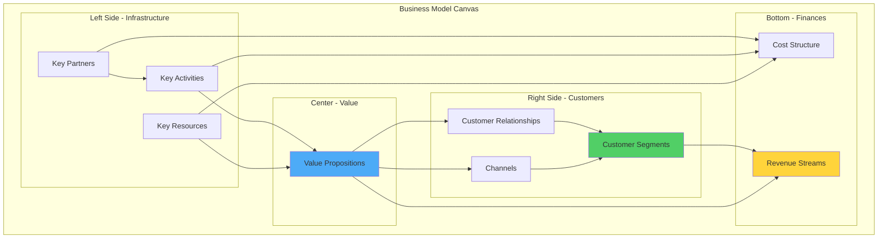

# RukaTi - Business Model Canvas

This document outlines the business model for RukaTi using the Business Model Canvas framework.

---

## Business Model Canvas Overview

---

## 1. Customer Segments 👥

### Primary Segments

#### **Service Seekers (Customers)**

**Demographics:**

- Age: 25-55 years old
- Location: Rijeka, Croatia (focus on Zamet, Centar, Trsat)
- Income: Middle to upper-middle class
- Tech-savvy: Comfortable using web platforms

**Characteristics:**

- Homeowners or renters
- Busy professionals with limited time
- Parents seeking tutoring or childcare
- Pet owners needing care services
- Event organizers

**Needs:**

- Quick, reliable service discovery
- Trustworthy local providers
- Transparent pricing
- Easy communication
- Quality assurance through reviews

---

#### **Service Providers**

**Demographics:**

- Age: 20-60 years old
- Location: Rijeka and surrounding areas
- Occupation: Independent contractors, freelancers, small businesses

**Types:**

- Home repair professionals (electricians, plumbers, handymen)
- Cleaning service providers
- Tutors and educators
- Pet care specialists
- Landscapers and gardeners
- Event support staff

**Needs:**

- Increased visibility and customer reach
- Simple listing management
- Direct customer communication
- Reputation building through reviews
- Low-cost marketing channel

---

### Secondary Segments (Future)

- **Small Businesses:** Companies offering services at scale
- **Property Managers:** Managing multiple properties needing services
- **Event Companies:** Coordinating multiple service providers

---

## 2. Value Propositions 💎

### For Service Seekers

**🎯 Primary Value:**

> "Find trusted local services in seconds, not hours"

**Key Benefits:**

1. **Simplicity:** Clean, uncluttered interface focused on services only
2. **Local Focus:** Rijeka-specific with neighborhood filtering
3. **Trust:** Community-driven reviews and ratings
4. **Speed:** Fast search and discovery
5. **Free Access:** No cost to browse and contact providers

**Differentiation:**

- Not cluttered with product ads (vs. Njuškalo)
- Searchable and organized (vs. Facebook Groups)
- Service-specific (vs. Google Maps)

---

### For Service Providers

**🎯 Primary Value:**

> "Get discovered by local customers without complex marketing"

**Key Benefits:**

1. **Visibility:** Dedicated platform for service discovery
2. **Simple Management:** Easy-to-use service listing tools
3. **Direct Contact:** Connect directly with customers
4. **Reputation Building:** Reviews and ratings system
5. **Low Barrier:** Free basic listings

**Differentiation:**

- Professional platform vs. social media chaos
- Service-focused vs. general classifieds
- Local targeting vs. broad platforms

---

## 3. Channels 📢

### Customer Acquisition Channels

**Digital Channels:**

1. **Organic Search (SEO)**
   - Google search for "services in Rijeka"
   - Local keywords optimization
   - Google My Business integration

2. **Social Media**
   - Facebook groups (Rijeka community groups)
   - Instagram (local hashtags)
   - Word-of-mouth sharing

3. **Direct Traffic**
   - Bookmarks and repeat visits
   - Referrals from satisfied users

**Offline Channels:** 4. **Local Partnerships**

- Flyers in local businesses
- Community centers
- Local events and meetups

5. **Word of Mouth**
   - Referral program (future)
   - Provider recommendations

---

### Service Delivery Channels

**Platform Access:**

- **Web Application:** Primary channel (mobile and desktop)
- **Mobile Browser:** Optimized mobile experience
- **Future:** Native mobile app (iOS/Android)

**Communication Channels:**

- **In-Platform:** Direct messaging (future)
- **External:** Phone and email contact
- **Notifications:** Email and push notifications (future)

---

## 4. Customer Relationships 🤝

### Relationship Types

#### **Self-Service**

- Automated account creation
- Self-managed service listings
- Browse and search without assistance

#### **Community-Driven**

- Reviews and ratings
- User-generated content
- Peer recommendations

#### **Automated Support**

- Email notifications
- In-app guidance
- FAQ and help documentation

#### **Personal Assistance (Future)**

- Customer support chat
- Provider onboarding assistance
- Dispute resolution

---

### Retention Strategies

**For Customers:**

1. **Saved Services:** Bookmark favorite providers
2. **Notifications:** Updates on saved services
3. **Review Reminders:** Encourage feedback
4. **Quality Curation:** Remove low-quality listings

**For Providers:**

1. **Analytics Dashboard:** Show listing performance
2. **Success Stories:** Highlight top providers
3. **Premium Features:** Upsell opportunities
4. **Community:** Provider forums and resources (future)

---

## 5. Revenue Streams 💰

### Current Model (MVP)

**Free Platform** - No revenue during MVP phase

- Focus on user acquisition and validation
- Build network effects
- Establish market presence

---

### Future Revenue Streams

#### **1. Promoted Listings** 💵

**Model:** Pay-per-promotion

- Providers pay to feature services at top of search results
- Promoted badge on service cards
- Priority placement in category pages

**Pricing:**

- €10-20 per service per month
- €50-100 for multiple services
- Tiered pricing based on category demand

**Target:** 10% of providers using promoted listings

---

#### **2. Premium Provider Subscriptions** 💎

**Model:** Monthly/Annual subscription

**Features:**

- Unlimited service listings (vs. 3 free)
- Advanced analytics and insights
- Priority customer support
- Verified provider badge
- Custom profile URL
- Featured in "Top Providers" section

**Pricing:**

- €15/month or €150/year
- €25/month for business accounts

**Target:** 5-10% conversion from free to premium

---

#### **3. Transaction Fees (Future)** 💳

**Model:** Commission on completed services

**Structure:**

- 5-10% commission on service value
- Only charged after successful completion
- Requires in-platform payment system

**Requirements:**

- Payment gateway integration (Stripe)
- Escrow system for trust
- Service completion verification

---

#### **4. Advertising (Minimal)** 📢

**Model:** Sponsored content (carefully implemented)

**Types:**

- Sponsored service categories
- Local business partnerships
- Non-intrusive banner ads

**Constraints:**

- Must not compromise user experience
- Relevant to service marketplace
- Limited ad inventory

---

#### **5. Data & Insights (Future)** 📊

**Model:** Anonymized market insights

**Products:**

- Market research reports for businesses
- Service demand trends
- Pricing benchmarks

**Target:** B2B customers (service companies, investors)

---

## 6. Key Resources 🔑

### Human Resources

- **Developer:** Full-stack development (solo founder)
- **Future Hires:**
  - Customer support representative
  - Marketing specialist
  - Content moderator

### Technological Resources

- **Supabase:** Database, authentication, storage
- **Vercel/Netlify:** Hosting and deployment
- **Domain:** rukati.hr (or similar)
- **Development Tools:** Bun, Vite, React, TypeScript

### Intellectual Property

- **Brand:** RukaTi name and logo
- **Codebase:** Proprietary platform code
- **User Data:** Customer and provider information
- **Reviews:** Community-generated content

### Financial Resources

- **Bootstrap Funding:** Personal investment
- **Future:** Potential angel investment or grants

---

## 7. Key Activities 🎯

### Platform Development

- Feature development and iteration
- Bug fixes and maintenance
- Performance optimization
- Security updates

### User Acquisition

- SEO optimization
- Social media marketing
- Local community engagement
- Partnership development

### Quality Assurance

- Content moderation
- Provider verification
- Review authenticity checks
- Platform monitoring

### Customer Support

- User inquiries and assistance
- Dispute resolution
- Onboarding support
- Feedback collection

---

## 8. Key Partnerships 🤝

### Technology Partners

- **Supabase:** Backend infrastructure
- **Vercel/Netlify:** Hosting and CDN
- **Stripe:** Payment processing (future)
- **Cloudflare:** CDN and security

### Business Partners

- **Local Businesses:** Cross-promotion opportunities
- **Community Organizations:** User acquisition
- **Trade Associations:** Provider recruitment
- **Media Outlets:** PR and visibility

### Service Partners

- **Email Service:** Transactional emails (SendGrid, Mailgun)
- **SMS Provider:** Notifications (Twilio)
- **Analytics:** User behavior tracking (Google Analytics)
- **Error Tracking:** Sentry for monitoring

---

## 9. Cost Structure 💸

### Fixed Costs

**Infrastructure:**

- Supabase: €0-25/month (free tier initially, scales with usage)
- Hosting: €0-20/month (Vercel/Netlify free tier)
- Domain: €15/year
- Email Service: €0-10/month

**Development:**

- Developer time (solo founder - sweat equity)
- Development tools and licenses: €0-50/month

**Total Fixed Costs (MVP):** €50-100/month

---

### Variable Costs

**Scaling Costs:**

- Database storage: Scales with user growth
- Bandwidth: Scales with traffic
- File storage: Scales with image uploads
- API calls: Scales with platform usage

**Marketing:**

- Social media ads: €100-500/month (when launched)
- SEO tools: €50-100/month
- Local advertising: €100-300/month

**Operations:**

- Customer support tools: €20-50/month
- Moderation tools: €0-100/month
- Analytics and monitoring: €0-50/month

**Total Variable Costs:** €270-1,100/month (post-launch)

---

### Cost Optimization Strategies

1. **Leverage Free Tiers:** Maximize use of free plans (Supabase, Vercel)
2. **Open Source:** Use open-source tools where possible
3. **Automation:** Automate repetitive tasks
4. **Lean Operations:** Minimal overhead, focus on core features
5. **Community Moderation:** User-driven content moderation

---

## Financial Projections (Year 1)

### Revenue Forecast

**Assumptions:**

- 200 registered providers by end of Year 1
- 10% conversion to promoted listings (20 providers)
- 5% conversion to premium (10 providers)

**Revenue Breakdown:**

- Promoted Listings: 20 × €15/month × 12 = €3,600
- Premium Subscriptions: 10 × €15/month × 12 = €1,800
- **Total Year 1 Revenue:** €5,400

---

### Cost Forecast

**Year 1 Costs:**

- Infrastructure: €1,200
- Marketing: €3,600
- Operations: €1,200
- **Total Year 1 Costs:** €6,000

**Year 1 Net:** -€600 (acceptable for MVP validation)

---

### Break-Even Analysis

**Break-Even Point:**

- Monthly revenue needed: €500
- Requires: ~30 promoted listings OR 30 premium providers
- Estimated timeline: Month 8-10 post-launch

---

## Growth Strategy

### Phase 1: MVP Validation (Months 1-6)

- **Goal:** Validate product-market fit
- **Focus:** User acquisition, feedback collection
- **Target:** 50 providers, 200 customers, 100 services

### Phase 2: Monetization (Months 7-12)

- **Goal:** Introduce revenue streams
- **Focus:** Promoted listings, premium features
- **Target:** €500/month revenue

### Phase 3: Scale (Year 2)

- **Goal:** Expand user base and revenue
- **Focus:** Marketing, feature expansion
- **Target:** 500 providers, €2,000/month revenue

### Phase 4: Expansion (Year 3+)

- **Goal:** Expand to other Croatian cities
- **Focus:** Geographic expansion, partnerships
- **Target:** 2,000+ providers, €10,000/month revenue

---

## Competitive Advantages

1. **Local Focus:** Deep integration with Rijeka community
2. **Service-Only:** Not diluted with product listings
3. **Technical Minimalist UX:** Superior user experience
4. **Community Trust:** Reviews and ratings system
5. **Low Cost:** Freemium model accessible to all
6. **Agility:** Fast iteration based on user feedback

---

## Risk Mitigation

**Low Adoption Risk:**

- Mitigation: Strong local marketing, partnerships

**Competition Risk:**

- Mitigation: Superior UX, local focus, community building

**Monetization Risk:**

- Mitigation: Multiple revenue streams, freemium model

**Technical Risk:**

- Mitigation: Reliable infrastructure (Supabase), monitoring

---

**Last Updated:** December 18, 2025
