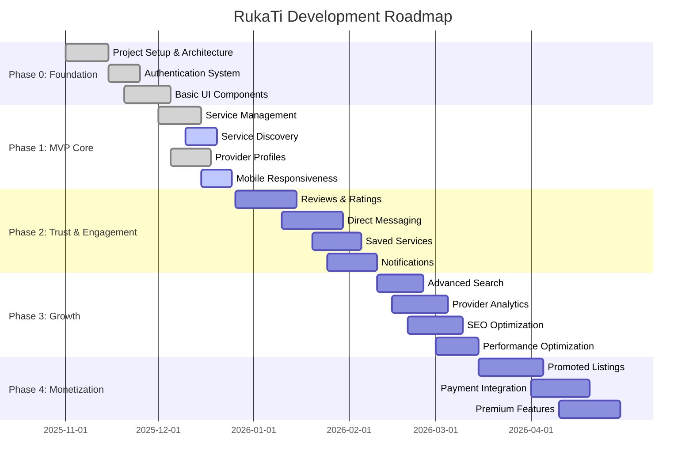

# RukaTi - Milestones & Roadmap

This document outlines the development roadmap for RukaTi, organized into phases with clear milestones, deliverables, and success criteria.

---

## Roadmap Overview

---

## Phase 0: Foundation ✅ COMPLETED

**Timeline:** November 1 - December 5, 2025  
**Status:** ✅ Completed  
**Goal:** Establish technical foundation and core infrastructure

### Milestones

#### M0.1: Project Setup ✅

**Completed:** November 15, 2025

**Deliverables:**

- ✅ Vite + React + TypeScript project initialized
- ✅ Tailwind CSS configured
- ✅ Bun package manager setup
- ✅ Git repository initialized
- ✅ ESLint and Prettier configured
- ✅ Project structure defined

**Success Criteria:**

- Development server runs successfully
- Build process works without errors
- Code formatting and linting functional

---

#### M0.2: Authentication System ✅

**Completed:** November 25, 2025

**Deliverables:**

- ✅ Supabase project configured
- ✅ User registration flow
- ✅ Login/logout functionality
- ✅ Session management with Zustand
- ✅ Protected routes with TanStack Router
- ✅ User profile creation

**Success Criteria:**

- Users can register and login
- Sessions persist across page refreshes
- Protected routes redirect unauthenticated users
- User profiles created automatically on registration

---

#### M0.3: UI Component Library ✅

**Completed:** December 5, 2025

**Deliverables:**

- ✅ shadcn/ui components integrated
- ✅ Custom button, input, card components
- ✅ Dialog and modal components
- ✅ Navigation components
- ✅ Technical Minimalist design system
- ✅ Responsive layout components

**Success Criteria:**

- Consistent design across all pages
- Components reusable and well-documented
- Mobile-responsive layouts
- Accessibility features implemented

---

## Phase 1: MVP Core Features 🚧 IN PROGRESS

**Timeline:** December 1 - December 25, 2025  
**Status:** 🚧 80% Complete  
**Goal:** Build core service marketplace functionality

### Milestones

#### M1.1: Service Management ✅

**Completed:** December 15, 2025

**Deliverables:**

- ✅ Create service modal with form validation
- ✅ Edit service functionality
- ✅ Delete service with confirmation
- ✅ Service image upload to Supabase storage
- ✅ Availability toggle
- ✅ Service listing in provider dashboard

**Success Criteria:**

- Providers can create services with all required fields
- Form validation prevents invalid submissions
- Images upload and display correctly
- Services can be edited and deleted
- Changes reflect immediately in UI

**Technical Implementation:**

- React Hook Form + Zod validation
- Supabase storage for images
- Zustand state management
- Modal-based UI workflow

---

#### M1.2: Service Discovery 🚧

**Status:** In Progress (90% complete)

**Deliverables:**

- ✅ Services marketplace page
- ✅ Category filtering sidebar
- ✅ Service cards with key information
- ✅ Service detail pages
- 🚧 Location/neighborhood filtering
- 🚧 Search functionality

**Success Criteria:**

- Customers can browse all services
- Category filters work correctly
- Service cards display accurate information
- Service detail pages show complete information
- Filters update results in real-time

**Remaining Work:**

- Implement neighborhood filter dropdown
- Add search bar with query functionality
- Optimize query performance

---

#### M1.3: Provider Profiles ✅

**Completed:** December 18, 2025

**Deliverables:**

- ✅ Provider profile pages
- ✅ Display provider information (name, bio, avatar, rating)
- ✅ List all services by provider
- ✅ Profile editing functionality
- ✅ Avatar upload

**Success Criteria:**

- Provider profiles accessible from service details
- All provider services displayed
- Profile information editable by owner
- Avatar images display correctly

---

#### M1.4: Mobile Responsiveness 🚧

**Status:** In Progress (85% complete)

**Deliverables:**

- ✅ Mobile-responsive navigation
- ✅ Responsive service cards
- ✅ Mobile-optimized forms
- 🚧 Mobile filter drawer
- ✅ Touch-friendly UI elements

**Success Criteria:**

- Platform usable on mobile devices (320px+)
- No horizontal scrolling
- Touch targets minimum 44x44px
- Forms easy to fill on mobile
- Performance acceptable on mobile networks

**Remaining Work:**

- Complete mobile filter drawer implementation
- Test on various mobile devices
- Optimize mobile performance

---

## Phase 2: Trust & Engagement 📋 PLANNED

**Timeline:** December 26, 2025 - February 10, 2026  
**Status:** 📋 Planned  
**Goal:** Build trust and increase user engagement

### Milestones

#### M2.1: Reviews & Ratings System

**Target Date:** January 15, 2026

**Deliverables:**

- [ ] Review submission form
- [ ] Star rating component
- [ ] Review display on service pages
- [ ] Review display on provider profiles
- [ ] Average rating calculation
- [ ] Review moderation tools
- [ ] Prevent duplicate reviews

**Success Criteria:**

- Users can submit reviews after service interaction
- Reviews display on service and provider pages
- Ratings update provider and service scores
- Fake/spam reviews can be flagged and removed

**Technical Requirements:**

- New `reviews` table in Supabase
- Foreign keys to users and services
- Rating aggregation queries
- Review validation logic

**Dependencies:**

- M1.1 (Service Management)
- M1.3 (Provider Profiles)

---

#### M2.2: Direct Messaging

**Target Date:** January 30, 2026

**Deliverables:**

- [ ] In-app messaging interface
- [ ] Real-time message delivery
- [ ] Message notifications
- [ ] Conversation history
- [ ] Message read status
- [ ] Block/report users

**Success Criteria:**

- Customers can message providers directly
- Messages delivered in real-time
- Conversation history persists
- Users notified of new messages
- Privacy controls functional

**Technical Requirements:**

- `messages` and `conversations` tables
- Supabase Realtime subscriptions
- WebSocket connections for live updates
- Notification system integration

**Dependencies:**

- M0.2 (Authentication)
- M2.4 (Notifications)

---

#### M2.3: Saved Services

**Target Date:** February 5, 2026

**Deliverables:**

- [ ] Save/unsave service functionality
- [ ] Saved services list page
- [ ] Save button on service cards
- [ ] Saved count indicator
- [ ] Remove from saved list

**Success Criteria:**

- Users can save services for later
- Saved services accessible from dashboard
- Save status persists across sessions
- Easy to remove from saved list

**Technical Requirements:**

- `saved_services` junction table
- User-specific queries
- Optimistic UI updates

**Dependencies:**

- M0.2 (Authentication)
- M1.2 (Service Discovery)

---

#### M2.4: Notification System

**Target Date:** February 10, 2026

**Deliverables:**

- [ ] In-app notification center
- [ ] Email notifications (optional)
- [ ] Notification preferences
- [ ] Notification types:
  - New message received
  - Service review received
  - Service inquiry received
- [ ] Mark as read functionality
- [ ] Notification badge counter

**Success Criteria:**

- Users receive timely notifications
- Notification preferences respected
- Notifications link to relevant content
- Read/unread status tracked

**Technical Requirements:**

- `notifications` table
- Email service integration (optional)
- Real-time notification delivery
- Notification templates

**Dependencies:**

- M0.2 (Authentication)

---

## Phase 3: Growth & Optimization 📋 PLANNED

**Timeline:** February 10 - March 15, 2026  
**Status:** 📋 Planned  
**Goal:** Scale platform and improve discoverability

### Milestones

#### M3.1: Advanced Search & Filtering

**Target Date:** February 25, 2026

**Deliverables:**

- [ ] Full-text search across services
- [ ] Multi-criteria filtering (category + location + price)
- [ ] Sort options (rating, date, price)
- [ ] Search suggestions/autocomplete
- [ ] Recent searches
- [ ] Search result highlighting

**Success Criteria:**

- Search returns relevant results quickly (<500ms)
- Filters can be combined
- Search works across title and description
- Results sorted by relevance

**Technical Requirements:**

- Supabase full-text search or Algolia integration
- Indexed database columns
- Search query optimization
- Debounced search input

---

#### M3.2: Provider Analytics Dashboard

**Target Date:** March 5, 2026

**Deliverables:**

- [ ] Service view statistics
- [ ] Contact/inquiry tracking
- [ ] Rating trends over time
- [ ] Popular services insights
- [ ] Performance metrics
- [ ] Export data functionality

**Success Criteria:**

- Providers see meaningful insights
- Data visualizations clear and actionable
- Metrics update in real-time
- Historical data accessible

**Technical Requirements:**

- Analytics data collection
- Aggregation queries
- Chart library integration (Recharts)
- Data export functionality

---

#### M3.3: SEO Optimization

**Target Date:** March 10, 2026

**Deliverables:**

- [ ] Meta tags for all pages
- [ ] Open Graph tags
- [ ] Structured data (Schema.org)
- [ ] XML sitemap
- [ ] Robots.txt
- [ ] Canonical URLs
- [ ] Performance optimization (Core Web Vitals)

**Success Criteria:**

- Pages indexed by Google
- Rich snippets in search results
- Lighthouse SEO score >90
- Core Web Vitals pass

**Technical Requirements:**

- React Helmet or similar for meta tags
- Server-side rendering consideration
- Image optimization
- Code splitting

---

#### M3.4: Performance Optimization

**Target Date:** March 15, 2026

**Deliverables:**

- [ ] Code splitting and lazy loading
- [ ] Image optimization (WebP, lazy loading)
- [ ] Database query optimization
- [ ] Caching strategy (React Query)
- [ ] CDN for static assets
- [ ] Bundle size reduction

**Success Criteria:**

- Lighthouse Performance score >90
- First Contentful Paint <1.5s
- Time to Interactive <3.5s
- Bundle size <200KB (gzipped)

**Technical Requirements:**

- Vite build optimization
- React.lazy() for route-based splitting
- Image compression pipeline
- Database indexing

---

## Phase 4: Monetization & Premium Features 📋 PLANNED

**Timeline:** March 15 - April 30, 2026  
**Status:** 📋 Planned  
**Goal:** Generate revenue and offer premium value

### Milestones

#### M4.1: Promoted Listings

**Target Date:** April 5, 2026

**Deliverables:**

- [ ] Promoted listing selection interface
- [ ] Promoted badge on service cards
- [ ] Priority placement in search results
- [ ] Promoted listings section on homepage
- [ ] Promotion duration management
- [ ] Promotion analytics

**Success Criteria:**

- Promoted services appear at top of results
- Clear visual distinction from regular listings
- Providers can select services to promote
- Promotion duration tracked accurately

**Technical Requirements:**

- `promoted_services` table
- Promotion expiry logic
- Modified query sorting
- Payment integration (if paid)

---

#### M4.2: Payment Integration

**Target Date:** April 20, 2026

**Deliverables:**

- [ ] Payment gateway integration (Stripe)
- [ ] Pricing plans for providers
- [ ] Payment processing
- [ ] Invoice generation
- [ ] Payment history
- [ ] Refund handling

**Success Criteria:**

- Secure payment processing
- Multiple payment methods supported
- Automatic invoice generation
- Payment failures handled gracefully

**Technical Requirements:**

- Stripe integration
- Webhook handling
- Payment state management
- PCI compliance

---

#### M4.3: Premium Provider Features

**Target Date:** April 30, 2026

**Deliverables:**

- [ ] Premium provider badges
- [ ] Unlimited service listings
- [ ] Advanced analytics
- [ ] Priority customer support
- [ ] Custom profile URL
- [ ] Featured provider section

**Success Criteria:**

- Clear value proposition for premium
- Premium features functional
- Upgrade/downgrade flow smooth
- Billing automated

**Technical Requirements:**

- Subscription management
- Feature flags for premium users
- Billing cycle automation
- Upgrade/downgrade logic

---

## Future Phases (Post-MVP)

### Phase 5: Advanced Features

- Service booking/scheduling system
- In-app payment escrow
- Service contracts/agreements
- Multi-language support (Croatian/English)
- Mobile app (React Native)

### Phase 6: Community & Trust

- Provider verification program
- Background checks integration
- Insurance partnerships
- Community forums
- Provider training resources

### Phase 7: Expansion

- Expand to other Croatian cities
- Category expansion
- Business accounts for companies
- API for third-party integrations
- White-label solution for other regions

---

## Success Metrics by Phase

### Phase 1 (MVP) Success Criteria

- **Users:** 50 registered users (25 providers, 25 customers)
- **Services:** 100 service listings
- **Engagement:** 500 service views per week
- **Quality:** Average service rating >4.0/5.0

### Phase 2 (Trust) Success Criteria

- **Reviews:** 50+ reviews submitted
- **Messages:** 100+ conversations initiated
- **Retention:** 60% monthly active user retention
- **Saved Services:** 200+ services saved

### Phase 3 (Growth) Success Criteria

- **Users:** 200 registered users
- **Services:** 500 service listings
- **Traffic:** 2,000 unique visitors per month
- **SEO:** Ranking for 10+ local keywords

### Phase 4 (Monetization) Success Criteria

- **Revenue:** €500/month from promoted listings
- **Premium Users:** 10 premium providers
- **Conversion:** 5% free-to-premium conversion rate

---

## Risk Mitigation Timeline

| Phase   | Key Risks                      | Mitigation Actions                  |
| ------- | ------------------------------ | ----------------------------------- |
| Phase 1 | Low adoption, technical issues | Focus on UX, thorough testing       |
| Phase 2 | Trust concerns, spam           | Implement moderation, verification  |
| Phase 3 | Scalability, performance       | Optimize queries, implement caching |
| Phase 4 | Monetization resistance        | Clear value prop, freemium model    |

---

## Dependencies & Blockers

### Critical Path

1. **Phase 1 must complete** before Phase 2 (reviews need services)
2. **Messaging requires notifications** (M2.4 before M2.2)
3. **Monetization requires analytics** (M3.2 before M4.1)
4. **Payment integration before premium features** (M4.2 before M4.3)

### External Dependencies

- Supabase service availability
- Payment gateway approval (Stripe)
- Legal review for terms of service
- Domain and hosting setup

---

**Last Updated:** December 18, 2025  
**Next Review:** January 1, 2026
