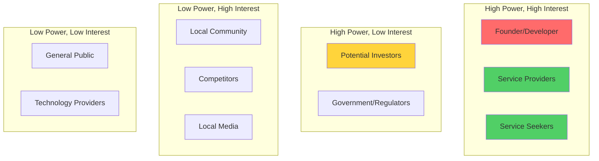

# RukaTi - Stakeholder Analysis

This document identifies and analyzes all stakeholders involved in the RukaTi platform, their interests, influence, and engagement strategies.

---

## Stakeholder Mapping

---

## Primary Stakeholders

### 1. Service Providers 👷

**Role:** Core users who create service listings

**Interests:**

- Gaining new customers
- Building reputation
- Easy platform management
- Fair pricing and fees
- Visibility and discoverability

**Influence:** 🔴 **Critical** - Platform cannot exist without providers

**Concerns:**

- Platform fees cutting into profits
- Competition from other providers
- Quality of customer leads
- Platform reliability

**Engagement Strategy:**

1. **Onboarding Support:** Easy registration and listing creation
2. **Communication:** Regular updates on platform improvements
3. **Feedback Loop:** Surveys and feature requests
4. **Recognition:** Highlight top providers, success stories
5. **Education:** Best practices for service listings

**Communication Channels:**

- Email newsletters
- In-app notifications
- Provider community forum (future)
- Social media groups

**Success Metrics:**

- Provider retention rate
- Services per provider
- Provider satisfaction score
- Active provider percentage

---

### 2. Service Seekers (Customers) 🙋

**Role:** Users searching for and hiring services

**Interests:**

- Finding reliable service providers
- Transparent pricing
- Quality assurance
- Easy communication
- Safe transactions

**Influence:** 🔴 **Critical** - Platform value depends on customer demand

**Concerns:**

- Trustworthiness of providers
- Service quality
- Privacy and data security
- Hidden costs

**Engagement Strategy:**

1. **User Experience:** Simple, fast service discovery
2. **Trust Building:** Reviews, ratings, verification badges
3. **Support:** Responsive customer service
4. **Education:** How to choose quality providers
5. **Feedback:** Easy reporting and review system

**Communication Channels:**

- Email notifications
- In-app messages
- Social media
- Help center/FAQ

**Success Metrics:**

- Customer retention rate
- Services contacted per user
- Customer satisfaction score
- Repeat usage rate

---

### 3. Founder/Developer 👨‍💻

**Role:** Creator, developer, and owner of RukaTi

**Interests:**

- Platform success and growth
- User satisfaction
- Revenue generation
- Technical excellence
- Market validation

**Influence:** 🔴 **Critical** - Decision maker and executor

**Responsibilities:**

- Platform development
- Strategic direction
- User acquisition
- Quality assurance
- Financial management

**Challenges:**

- Limited resources (solo founder)
- Time management
- Technical debt
- Burnout risk

**Success Metrics:**

- User growth
- Revenue milestones
- Platform uptime
- Feature delivery
- Work-life balance

---

## Secondary Stakeholders

### 4. Technology Partners 🔧

**Supabase**

- **Role:** Backend infrastructure provider
- **Interest:** Platform success drives their usage
- **Influence:** 🟠 High - Critical dependency
- **Engagement:** Monitor service quality, stay updated on features

**Vercel/Netlify**

- **Role:** Hosting and deployment
- **Interest:** Showcase successful deployments
- **Influence:** 🟡 Medium - Alternative options available
- **Engagement:** Optimize usage, leverage free tier

**Stripe (Future)**

- **Role:** Payment processing
- **Interest:** Transaction volume
- **Influence:** 🟠 High - Required for monetization
- **Engagement:** Integration planning, compliance

---

### 5. Local Community Organizations 🏘️

**Community Centers**

- **Role:** Potential partners for user acquisition
- **Interest:** Supporting local economy
- **Influence:** 🟡 Medium - Access to target audience
- **Engagement:** Partnership opportunities, cross-promotion

**Neighborhood Associations**

- **Role:** Community representatives
- **Interest:** Quality services for residents
- **Influence:** 🟡 Medium - Trust and credibility
- **Engagement:** Collaboration, feedback on local needs

**Local Businesses**

- **Role:** Potential partners and advertisers
- **Interest:** Customer acquisition
- **Influence:** 🟡 Medium - Marketing channels
- **Engagement:** Partnership proposals, advertising opportunities

---

### 6. Government & Regulators 🏛️

**Croatian Business Authorities**

- **Role:** Regulatory oversight
- **Interest:** Legal compliance, tax collection
- **Influence:** 🔴 Critical - Legal requirements
- **Concerns:** Business registration, tax compliance, consumer protection

**Data Protection Authority**

- **Role:** GDPR enforcement
- **Interest:** User data protection
- **Influence:** 🔴 Critical - Legal compliance
- **Concerns:** Privacy policy, data handling, user consent

**Engagement Strategy:**

- Legal consultation
- Compliance documentation
- Transparent operations
- Proactive communication

---

### 7. Competitors 🏆

**Njuškalo**

- **Type:** General classifieds platform
- **Threat Level:** 🟡 Medium - Established but not service-focused
- **Strategy:** Differentiate with service-only focus

**Facebook Marketplace/Groups**

- **Type:** Social media marketplace
- **Threat Level:** 🟠 High - Large user base
- **Strategy:** Superior UX and organization

**Google Maps**

- **Type:** Business directory
- **Threat Level:** 🟡 Medium - Broad but not service-specific
- **Strategy:** Better filtering and service discovery

**Local Service Platforms (Future)**

- **Type:** Direct competitors
- **Threat Level:** 🔴 High - If well-funded
- **Strategy:** First-mover advantage, community building

**Engagement Strategy:**

- Monitor competitor features
- Identify gaps and opportunities
- Maintain competitive advantages
- Rapid iteration

---

### 8. Potential Investors 💰

**Angel Investors**

- **Interest:** ROI, market potential
- **Influence:** 🟠 High - Funding for growth
- **Concerns:** Market size, competition, monetization

**Venture Capital (Future)**

- **Interest:** Scalability, exit potential
- **Influence:** 🔴 Critical - Significant funding
- **Concerns:** Team, traction, unit economics

**Engagement Strategy:**

- Build traction before fundraising
- Prepare pitch deck and financials
- Network in startup community
- Demonstrate product-market fit

**What They Want to See:**

- User growth metrics
- Engagement statistics
- Revenue (or clear path to revenue)
- Competitive moats
- Scalability plan

---

### 9. Local Media 📰

**Local News Outlets**

- **Role:** Coverage and publicity
- **Interest:** Local business stories
- **Influence:** 🟡 Medium - Brand awareness

**Tech Blogs**

- **Role:** Platform reviews and features
- **Interest:** Innovative local tech
- **Influence:** 🟡 Medium - Credibility

**Engagement Strategy:**

- Press releases for milestones
- Success stories and case studies
- Founder interviews
- Community impact stories

---

### 10. Trade Associations 🤝

**Croatian Chamber of Trades and Crafts**

- **Role:** Represents service professionals
- **Interest:** Supporting members
- **Influence:** 🟡 Medium - Provider recruitment

**Professional Associations**

- **Role:** Industry-specific groups
- **Interest:** Member benefits
- **Influence:** 🟡 Medium - Credibility and trust

**Engagement Strategy:**

- Partnership opportunities
- Member discounts or benefits
- Co-marketing initiatives
- Verification partnerships

---

## Stakeholder Engagement Matrix

| Stakeholder        | Power  | Interest | Priority    | Engagement Strategy                        |
| ------------------ | ------ | -------- | ----------- | ------------------------------------------ |
| Service Providers  | High   | High     | 🔴 Critical | Collaborate closely, regular communication |
| Customers          | High   | High     | 🔴 Critical | Keep satisfied, gather feedback            |
| Founder            | High   | High     | 🔴 Critical | Self-management, prioritization            |
| Supabase           | High   | Medium   | 🟠 High     | Monitor closely, stay informed             |
| Regulators         | High   | Low      | 🟠 High     | Keep informed, ensure compliance           |
| Community Orgs     | Medium | High     | 🟡 Medium   | Keep informed, partnership opportunities   |
| Competitors        | Medium | High     | 🟡 Medium   | Monitor, differentiate                     |
| Investors          | High   | Medium   | 🟡 Medium   | Keep informed, build relationships         |
| Media              | Low    | Medium   | 🟢 Low      | Inform periodically                        |
| Trade Associations | Medium | Medium   | 🟡 Medium   | Collaborate, partnerships                  |

---

## Stakeholder Communication Plan

### Monthly Communications

**Service Providers:**

- Platform updates and new features
- Success stories and tips
- Performance insights (when analytics available)

**Customers:**

- New service categories
- Quality improvements
- Safety and trust updates

---

### Quarterly Communications

**Investors/Partners:**

- Growth metrics and milestones
- Strategic updates
- Financial performance (when applicable)

**Community Organizations:**

- Impact reports
- Partnership opportunities
- Community success stories

---

### Annual Communications

**Regulators:**

- Compliance reports
- Privacy policy updates
- Business registration renewals

**General Public:**

- Year in review
- Platform achievements
- Future roadmap

---

## Conflict Resolution

### Potential Conflicts

**Provider vs. Customer:**

- **Issue:** Service quality disputes
- **Resolution:** Review system, mediation, clear terms of service

**Provider vs. Platform:**

- **Issue:** Fee structure, policy changes
- **Resolution:** Transparent communication, gradual rollout, feedback incorporation

**Customer vs. Platform:**

- **Issue:** Privacy concerns, data usage
- **Resolution:** Clear privacy policy, user controls, transparency

**Competitor Actions:**

- **Issue:** Feature copying, price wars
- **Resolution:** Focus on differentiation, community building, innovation

---

## Stakeholder Success Criteria

### Service Providers

✅ Easy to create and manage listings  
✅ Receive quality customer inquiries  
✅ Build positive reputation through reviews  
✅ Affordable platform fees  
✅ Responsive support

### Customers

✅ Find services quickly (<2 minutes)  
✅ Trust provider quality (avg rating >4.0)  
✅ Easy communication with providers  
✅ Safe and secure platform  
✅ Free access to browse and contact

### Founder

✅ Sustainable user growth (20% MoM)  
✅ Positive user feedback (NPS >50)  
✅ Path to profitability (by Year 2)  
✅ Technical stability (99% uptime)  
✅ Work-life balance maintained

### Community

✅ Improved access to local services  
✅ Support for local economy  
✅ Job opportunities for providers  
✅ Positive community impact

---

## Stakeholder Feedback Mechanisms

### Continuous Feedback

**In-App Feedback:**

- Feedback button on all pages
- Bug reporting
- Feature requests

**Surveys:**

- Post-service satisfaction survey
- Quarterly user satisfaction survey
- Annual platform review

**Direct Communication:**

- Email support
- Social media engagement
- Community forums (future)

**Analytics:**

- User behavior tracking
- Feature usage statistics
- Conversion funnel analysis

---

## Risk Management by Stakeholder

| Stakeholder | Key Risk             | Mitigation                          |
| ----------- | -------------------- | ----------------------------------- |
| Providers   | Platform abandonment | Regular engagement, value delivery  |
| Customers   | Trust issues         | Reviews, verification, transparency |
| Founder     | Burnout              | Sustainable pace, automation        |
| Supabase    | Service outage       | Monitoring, backup plan             |
| Regulators  | Non-compliance       | Legal consultation, documentation   |
| Competitors | Market disruption    | Innovation, community focus         |
| Investors   | Low traction         | Focus on metrics, clear roadmap     |

---

**Last Updated:** December 18, 2025
