# RukaTi - Technical Architecture

This document provides a comprehensive overview of the RukaTi platform's technical architecture, including system design, data flow, and infrastructure.

---

## System Architecture Overview

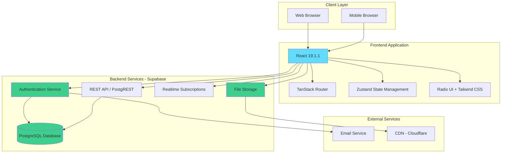

---

## Frontend Architecture

### Technology Stack

| Component             | Technology           | Version  | Purpose                       |
| --------------------- | -------------------- | -------- | ----------------------------- |
| **Framework**         | React                | 19.1.1   | UI library                    |
| **Language**          | TypeScript           | 5.9.3    | Type safety                   |
| **Build Tool**        | Vite                 | 7.1.7    | Fast development and bundling |
| **Routing**           | TanStack Router      | 1.133.13 | Type-safe routing             |
| **Styling**           | Tailwind CSS         | 4.1.14   | Utility-first CSS             |
| **UI Components**     | Radix UI + shadcn/ui | Latest   | Accessible primitives         |
| **State Management**  | Zustand              | 5.0.8    | Lightweight state management  |
| **Form Handling**     | React Hook Form      | 7.66.1   | Form validation               |
| **Schema Validation** | Zod                  | 4.1.12   | Runtime type checking         |
| **Package Manager**   | Bun                  | Latest   | Fast package management       |

### Component Architecture

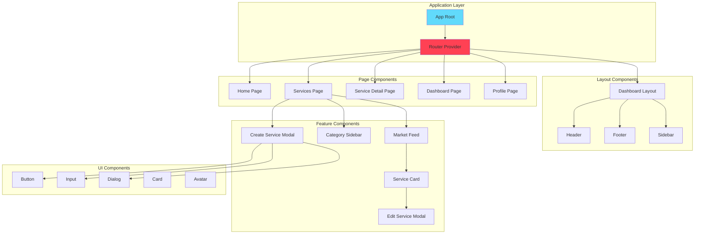

### Directory Structure

```
src/
├── assets/              # Static assets (images, fonts)
├── components/          # React components
│   ├── auth-card.tsx
│   ├── dashboard/       # Dashboard-specific components
│   │   ├── create-service-modal.tsx
│   │   ├── edit-service-modal.tsx
│   │   ├── service-card.tsx
│   │   ├── market-feed.tsx
│   │   └── categories-sidebar.tsx
│   ├── layouts/         # Layout components
│   │   └── dashboard-layout.tsx
│   ├── navigation/      # Navigation components
│   ├── profile/         # Profile components
│   ├── service-details/ # Service detail components
│   └── ui/              # Reusable UI components (shadcn)
├── const/               # Constants and configuration
│   ├── categories-section.ts
│   └── navigation-links.ts
├── hooks/               # Custom React hooks
├── lib/                 # Utility functions
├── pages/               # Page components
│   ├── services.tsx
│   ├── service-details.tsx
│   ├── provider-details.tsx
│   └── edit-profile.tsx
├── routes/              # TanStack Router routes
│   ├── __root.tsx
│   ├── index.tsx
│   ├── services.tsx
│   └── _authenticated/  # Protected routes
├── schemas/             # Zod validation schemas
│   └── services.ts
├── store/               # Zustand stores
│   ├── marketStore.ts
│   ├── userServicesStore.ts
│   ├── userProfileStore.ts
│   └── userSessionsStore.ts
├── types/               # TypeScript type definitions
│   ├── index.ts
│   └── user.ts
├── index.css            # Global styles
├── main.tsx             # Application entry point
└── supabase-client.ts   # Supabase client configuration
```

### State Management Architecture

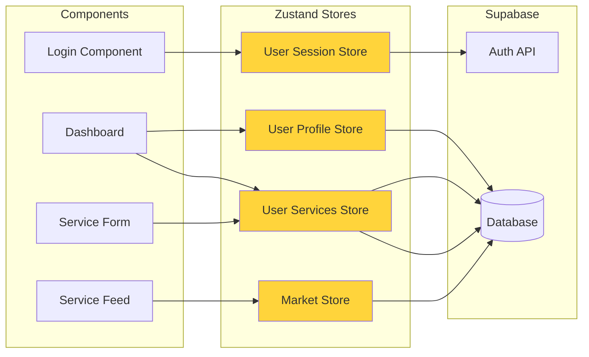

#### Store Responsibilities

**1. User Session Store (`userSessionsStore.ts`)**

- Current authenticated user
- Session state
- Login/logout actions

**2. User Profile Store (`userProfileStore.ts`)**

- Current user profile data
- Profile update actions
- Avatar management

**3. User Services Store (`userServicesStore.ts`)**

- User's own service listings
- CRUD operations for services
- Service state management

**4. Market Store (`marketStore.ts`)**

- All public services
- Service discovery and filtering
- Category filtering
- Service details
- Provider details

---

## Backend Architecture (Supabase)

### Database Schema

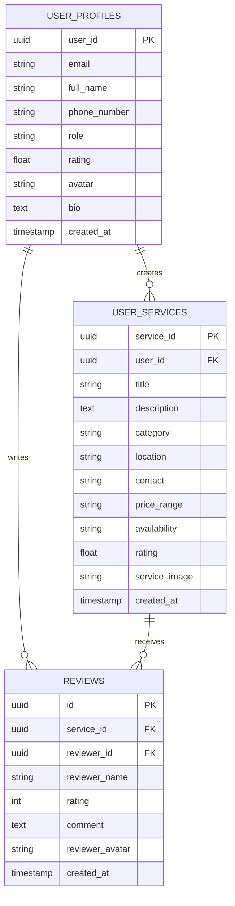

### Database Tables

#### `user_profiles`

```sql
CREATE TABLE user_profiles (
  user_id UUID PRIMARY KEY REFERENCES auth.users(id),
  email TEXT NOT NULL,
  full_name TEXT,
  phone_number TEXT NOT NULL,
  role TEXT NOT NULL DEFAULT 'customer',
  rating NUMERIC(3,2),
  avatar TEXT,
  bio TEXT,
  created_at TIMESTAMP WITH TIME ZONE DEFAULT NOW()
);
```

#### `user_services`

```sql
CREATE TABLE user_services (
  service_id UUID PRIMARY KEY DEFAULT uuid_generate_v4(),
  user_id UUID REFERENCES user_profiles(user_id) ON DELETE CASCADE,
  title TEXT NOT NULL,
  description TEXT NOT NULL,
  category TEXT NOT NULL,
  location TEXT,
  contact TEXT,
  price_range TEXT,
  availability TEXT,
  rating NUMERIC(3,2) DEFAULT 0,
  service_image TEXT,
  created_at TIMESTAMP WITH TIME ZONE DEFAULT NOW()
);
```

#### `reviews` (Planned)

```sql
CREATE TABLE reviews (
  id UUID PRIMARY KEY DEFAULT uuid_generate_v4(),
  service_id UUID REFERENCES user_services(service_id) ON DELETE CASCADE,
  reviewer_id UUID REFERENCES user_profiles(user_id) ON DELETE CASCADE,
  reviewer_name TEXT NOT NULL,
  rating INTEGER NOT NULL CHECK (rating >= 1 AND rating <= 5),
  comment TEXT,
  reviewer_avatar TEXT,
  created_at TIMESTAMP WITH TIME ZONE DEFAULT NOW()
);
```

### Row Level Security (RLS) Policies

```sql
-- user_profiles: Users can read all profiles, but only update their own
ALTER TABLE user_profiles ENABLE ROW LEVEL SECURITY;

CREATE POLICY "Public profiles are viewable by everyone"
  ON user_profiles FOR SELECT
  USING (true);

CREATE POLICY "Users can update own profile"
  ON user_profiles FOR UPDATE
  USING (auth.uid() = user_id);

-- user_services: All can read, only owner can modify
ALTER TABLE user_services ENABLE ROW LEVEL SECURITY;

CREATE POLICY "Services are viewable by everyone"
  ON user_services FOR SELECT
  USING (true);

CREATE POLICY "Users can insert own services"
  ON user_services FOR INSERT
  WITH CHECK (auth.uid() = user_id);

CREATE POLICY "Users can update own services"
  ON user_services FOR UPDATE
  USING (auth.uid() = user_id);

CREATE POLICY "Users can delete own services"
  ON user_services FOR DELETE
  USING (auth.uid() = user_id);
```

### Storage Buckets

**1. Service Images (`service-images`)**

- Public read access
- Authenticated write access
- File size limit: 5MB
- Allowed formats: JPG, PNG, WebP
- Path structure: `{user_id}/{service_id}/{filename}`

**2. Avatars (`avatars`)**

- Public read access
- Authenticated write access
- File size limit: 2MB
- Allowed formats: JPG, PNG, WebP
- Path structure: `{user_id}/{filename}`

---

## Data Flow Architecture

### Service Creation Flow

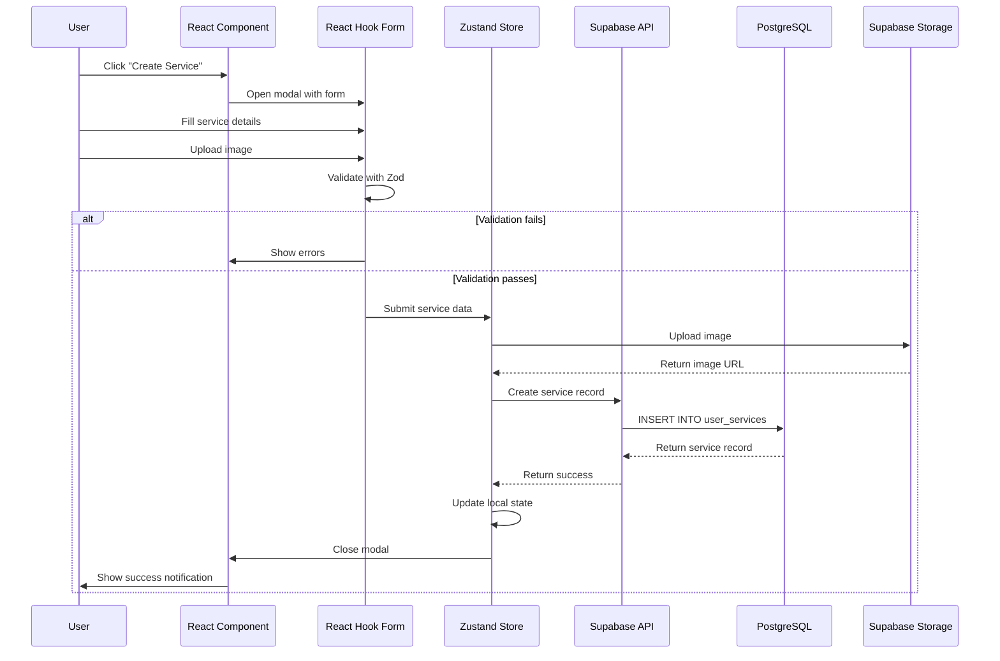

### Service Discovery Flow

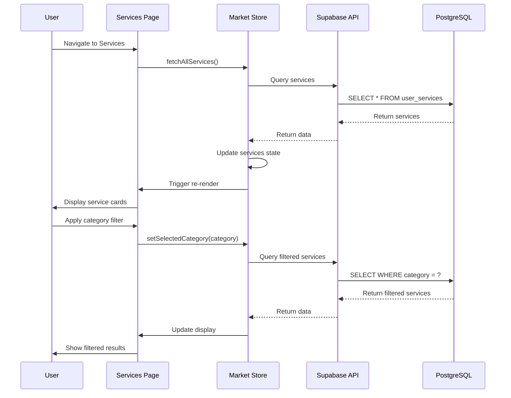

### Authentication Flow

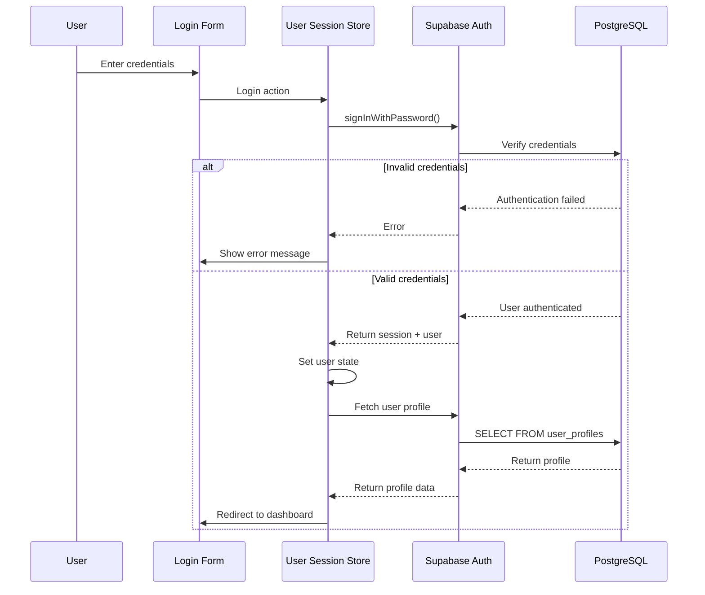

---

## Deployment Architecture

### Current Setup (Development)

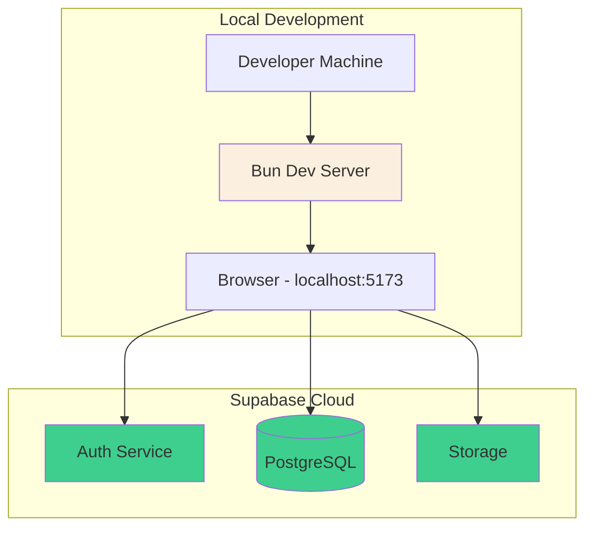

### Production Setup (Planned)

```mermaid
graph TB
    subgraph "Users"
        Desktop[Desktop Users]
        Mobile[Mobile Users]
    end

    subgraph "CDN - Cloudflare"
        CDN[Static Assets Cache]
    end

    subgraph "Hosting - Vercel/Netlify"
        Static[Static Site Hosting]
        Edge[Edge Functions]
    end

    subgraph "Supabase Cloud"
        Auth[Auth Service]
        DB[(PostgreSQL)]
        Storage[File Storage]
        Realtime[Realtime]
    end

    Desktop --> CDN
    Mobile --> CDN
    CDN --> Static
    Static --> Edge

    Edge --> Auth
    Edge --> DB
    Edge --> Storage
    Edge --> Realtime

    style CDN fill:#f38020
    style Static fill:#000000
    style Auth fill:#3ecf8e
    style DB fill:#3ecf8e
```

### Build & Deployment Process

```bash
# Development
bun install          # Install dependencies
bun dev              # Start dev server

# Production Build
bun run lint         # Lint code
bun run build        # Build for production
bun run preview      # Preview production build

# Deployment (Automated via CI/CD)
git push origin main # Trigger deployment
# → Vercel/Netlify builds and deploys automatically
```

---

## Security Architecture

### Authentication & Authorization

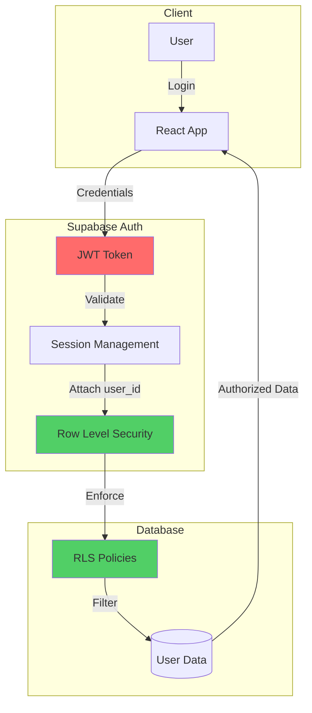

### Security Layers

1. **Transport Security**
   - HTTPS for all connections
   - Secure WebSocket (WSS) for Realtime

2. **Authentication**
   - Supabase Auth with JWT tokens
   - Secure session management
   - Password hashing (bcrypt)

3. **Authorization**
   - Row Level Security (RLS) policies
   - Role-based access control
   - User-specific data filtering

4. **Input Validation**
   - Client-side: Zod schemas
   - Server-side: Database constraints
   - File upload validation

5. **Data Protection**
   - Encrypted data at rest (Supabase)
   - Encrypted data in transit (HTTPS)
   - Secure file storage with access controls

---

## Performance Optimization

### Frontend Optimizations

1. **Code Splitting**
   - Route-based lazy loading
   - Component-level code splitting
   - Dynamic imports for heavy components

2. **Asset Optimization**
   - Image compression and lazy loading
   - WebP format for images
   - SVG for icons (Lucide React)

3. **Caching Strategy**
   - Browser caching for static assets
   - Service worker for offline support (future)
   - React Query for data caching (future)

4. **Bundle Optimization**
   - Tree shaking with Vite
   - Minification and compression
   - CSS purging with Tailwind

### Backend Optimizations

1. **Database Indexing**

   ```sql
   CREATE INDEX idx_services_category ON user_services(category);
   CREATE INDEX idx_services_user_id ON user_services(user_id);
   CREATE INDEX idx_services_created_at ON user_services(created_at DESC);
   ```

2. **Query Optimization**
   - Pagination for large result sets
   - Selective field fetching
   - Avoid N+1 queries

3. **Caching**
   - CDN for static assets
   - Database query caching
   - API response caching

---

## Scalability Considerations

### Horizontal Scaling

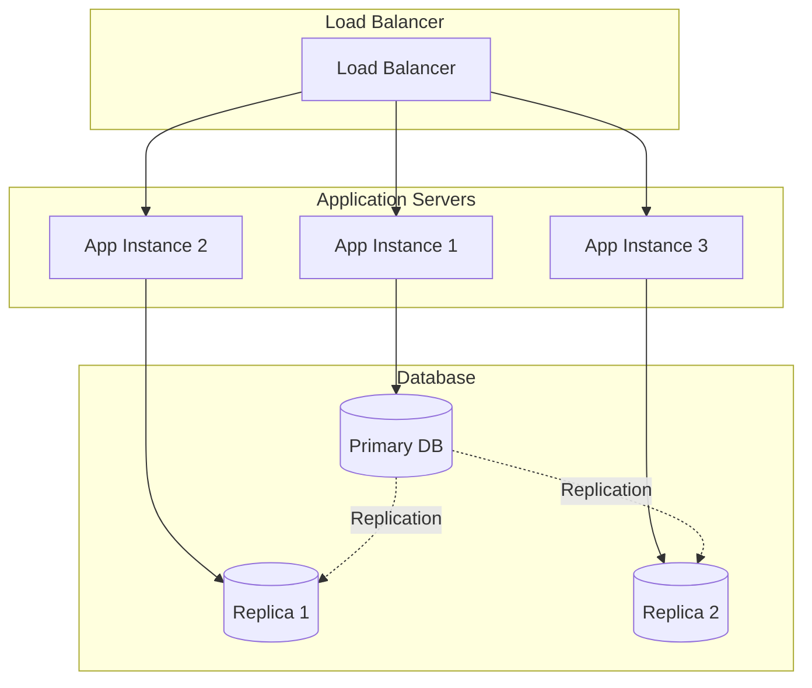

### Vertical Scaling

- Upgrade Supabase plan for more resources
- Increase database connection limits
- Optimize database queries and indexes

### Future Scaling Strategies

1. **Database Sharding** (if needed)
   - Shard by geographic region
   - Shard by user ID ranges

2. **Microservices** (if needed)
   - Separate messaging service
   - Separate payment service
   - Separate analytics service

3. **Caching Layer**
   - Redis for session storage
   - Redis for frequently accessed data
   - CDN for all static assets

---

## Monitoring & Observability

### Metrics to Track

1. **Performance Metrics**
   - Page load times
   - API response times
   - Database query performance
   - Core Web Vitals

2. **Business Metrics**
   - User registrations
   - Service creations
   - Service views
   - Contact requests

3. **Error Tracking**
   - JavaScript errors
   - API errors
   - Database errors
   - Authentication failures

### Tools (Planned)

- **Sentry:** Error tracking and monitoring
- **Google Analytics:** User behavior tracking
- **Supabase Dashboard:** Database and API metrics
- **Lighthouse CI:** Performance monitoring

---

**Last Updated:** December 18, 2025
