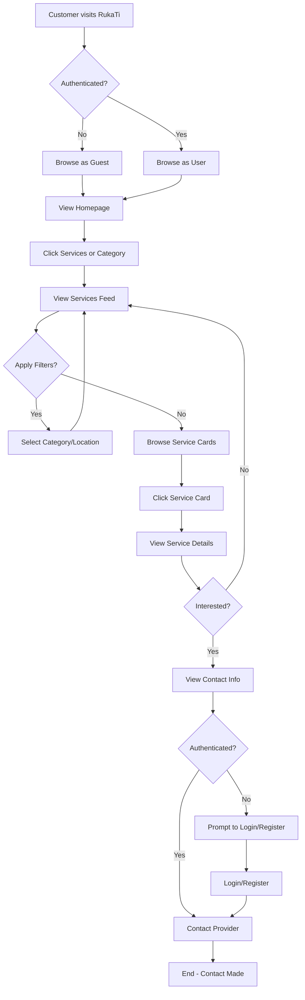
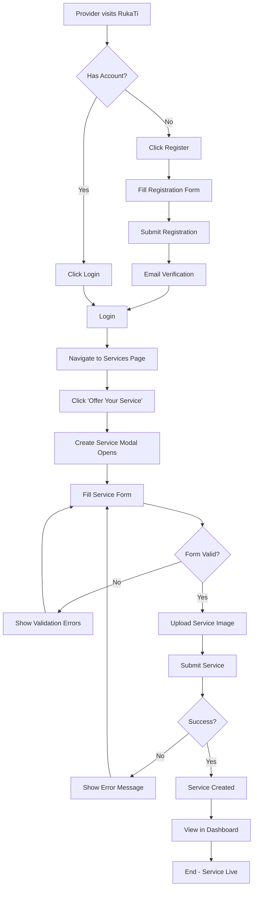
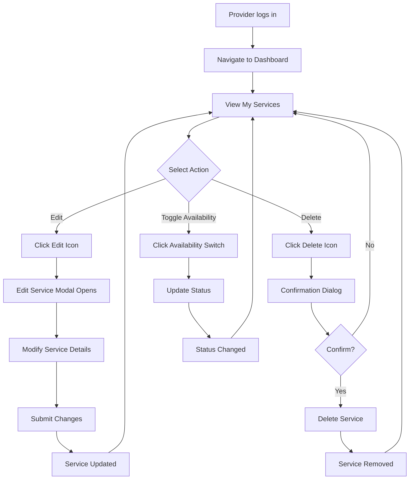
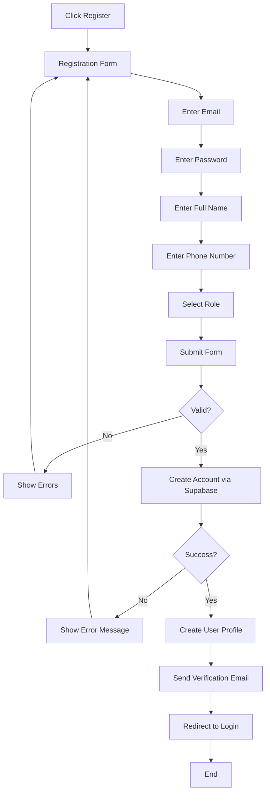
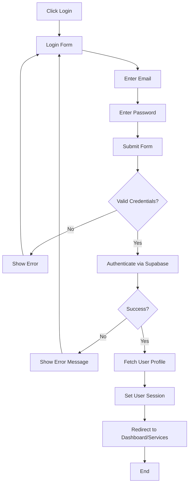
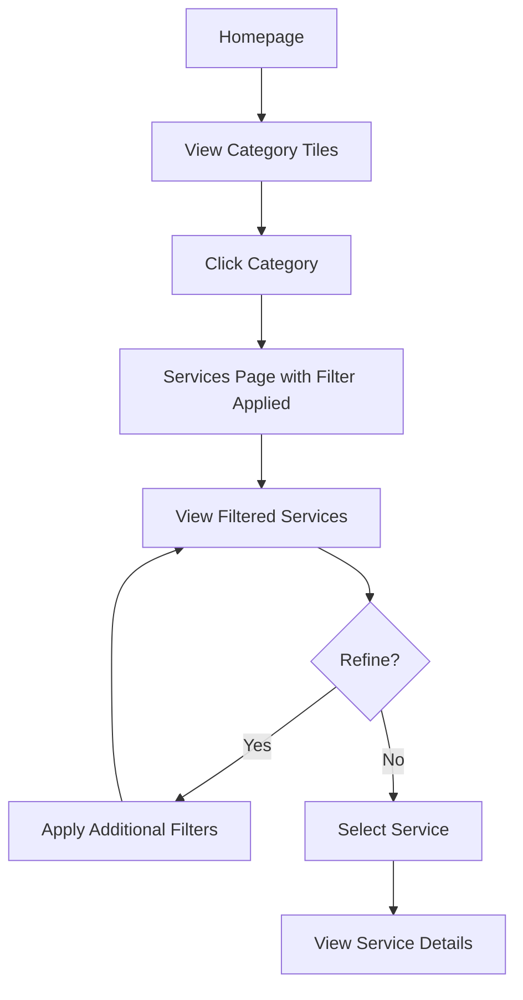
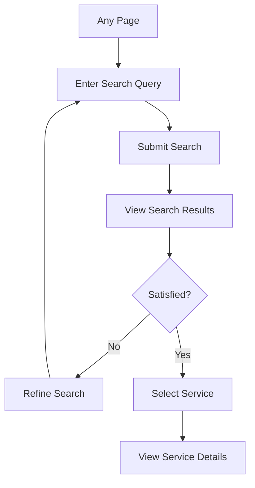
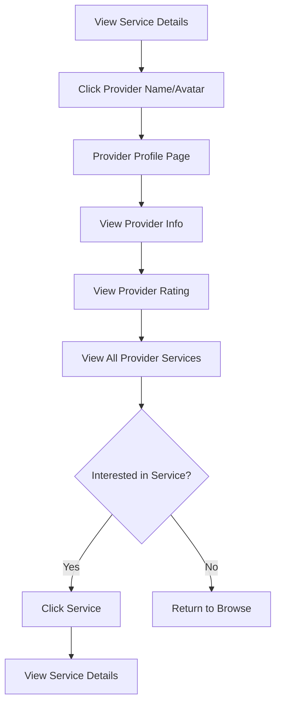

# RukaTi - User Flows

This document outlines the key user journeys and interaction flows within the RukaTi service marketplace platform.

---

## 1. Customer Journey - Finding a Service

### Flow Overview

A customer visits RukaTi to find a local service provider (e.g., cleaner, electrician, tutor).

### User Flow Diagram

### Detailed Steps

#### Step 1: Landing

- Customer arrives at homepage
- Sees hero section with value proposition
- Views featured categories
- Can browse without authentication

#### Step 2: Service Discovery

- **Option A:** Click on category tile from homepage
- **Option B:** Navigate to "Services" page
- **Option C:** Use search functionality (if implemented)

#### Step 3: Filtering & Browsing

- View services feed with category sidebar
- Apply filters:
  - **Category:** Home Repairs, Cleaning, Tutoring, Pet Care, Landscaping, Event Help, Other
  - **Location:** Neighborhood-based (Zamet, Centar, Trsat)
- Browse service cards showing:
  - Service title
  - Provider name
  - Category badge
  - Price range
  - Rating
  - Service image

#### Step 4: Service Details

- Click on service card
- View detailed service page:
  - Full description
  - Provider information
  - Contact details
  - Service images
  - Reviews (when implemented)
  - Availability status

#### Step 5: Contact Provider

- If authenticated: View contact information directly
- If not authenticated: Prompted to login/register
- Contact via provided phone/email

---

## 2. Service Provider Journey - Creating a Service

### Flow Overview

A service provider registers and creates their first service listing.

### User Flow Diagram

### Detailed Steps

#### Step 1: Registration

- Click "Register" button
- Fill registration form:
  - Email
  - Password
  - Full name
  - Phone number
  - Role selection (Customer/Provider)
- Submit and verify email
- Login with credentials

#### Step 2: Navigate to Services

- Click "Services" in navigation
- View services marketplace
- See "Offer Your Service" button (authenticated users only)

#### Step 3: Create Service Modal

- Click "Offer Your Service" button
- Modal opens with service creation form
- Form fields:
  - **Title** (required, min 3 characters)
  - **Description** (required, min 10 characters)
  - **Category** (required, dropdown selection)
  - **Location** (optional, text input)
  - **Contact** (optional, phone/email)
  - **Price Range** (optional, e.g., "50-100 EUR")
  - **Availability** (optional, e.g., "Weekdays 9-5")
  - **Service Image** (optional, drag-and-drop upload)

#### Step 4: Form Validation

- Real-time validation with React Hook Form + Zod
- Error messages displayed inline
- Submit button disabled until form is valid

#### Step 5: Service Creation

- Submit form to Supabase
- Image uploaded to storage (if provided)
- Service record created in `user_services` table
- Success notification displayed
- Modal closes
- Service appears in marketplace and provider's dashboard

---

## 3. Service Provider Journey - Managing Services

### Flow Overview

Provider edits, deletes, or updates availability of existing services.

### User Flow Diagram

### Detailed Steps

#### Edit Service

1. Navigate to dashboard
2. View list of own services
3. Click edit icon on service card
4. Edit service modal opens with pre-filled data
5. Modify any fields
6. Submit changes
7. Service updated in database
8. Success notification shown

#### Delete Service

1. Click delete icon on service card
2. Confirmation dialog appears
3. Confirm deletion
4. Service removed from database
5. Service card removed from UI
6. Success notification shown

#### Toggle Availability

1. Use availability switch on service card
2. Status updated immediately
3. Visual feedback provided
4. Database updated in background

---

## 4. Authentication Flow

### Registration Flow

### Login Flow

---

## 5. Service Discovery Flow (Customer)

### Category-Based Discovery

### Search-Based Discovery (Planned)

---

## 6. Provider Profile View Flow

### Flow Overview

Customer views a provider's profile to see all their services and information.

---

## 7. Future Flows (Planned Features)

### Review & Rating Flow

1. Customer completes service
2. Receives review prompt
3. Submits rating (1-5 stars) and comment
4. Review appears on service and provider profile
5. Provider rating updated

### Direct Messaging Flow

1. Customer clicks "Message Provider"
2. Chat interface opens
3. Send message
4. Provider receives notification
5. Provider responds
6. Conversation continues in-app

### Saved Services Flow

1. Customer clicks "Save" on service card
2. Service added to favorites list
3. Access saved services from dashboard
4. View/compare saved services
5. Remove from saved list

### Promoted Listings Flow

1. Provider selects service to promote
2. Choose promotion duration
3. Payment processing (if applicable)
4. Service appears in promoted section
5. Increased visibility in search results

---

## User Flow Summary

### Key Interaction Points

| User Type                  | Primary Actions                             | Key Pages                                      |
| -------------------------- | ------------------------------------------- | ---------------------------------------------- |
| **Guest Customer**         | Browse services, view details               | Homepage, Services, Service Details            |
| **Authenticated Customer** | Browse, contact providers, save services    | Homepage, Services, Service Details, Dashboard |
| **Service Provider**       | Create/edit/delete services, manage profile | Dashboard, Services, Profile Edit              |
| **Admin** (Future)         | Moderate content, manage users              | Admin Dashboard                                |

### Navigation Patterns

**Guest Users:**

- Home → Services → Service Details → Login/Register → Contact

**Authenticated Customers:**

- Home → Services → Service Details → Contact Provider
- Dashboard → Saved Services → Service Details

**Service Providers:**

- Dashboard → Create Service → Manage Services
- Services → Offer Service → Service Created
- Dashboard → Edit Profile → Update Information

---

## Mobile vs Desktop Flows

### Mobile-Specific Considerations

- **Hamburger Menu:** Navigation collapsed into mobile menu
- **Filters:** Mobile filter drawer instead of sidebar
- **Touch Interactions:** Larger touch targets for buttons
- **Modal Forms:** Full-screen modals on mobile devices
- **Swipe Gestures:** Potential for swipe-based navigation (future)

### Desktop-Specific Features

- **Sidebar Navigation:** Persistent category sidebar
- **Hover States:** Rich hover interactions on service cards
- **Multi-Column Layouts:** Grid-based service display
- **Keyboard Shortcuts:** Potential for power-user features (future)

---

**Last Updated:** December 18, 2025
